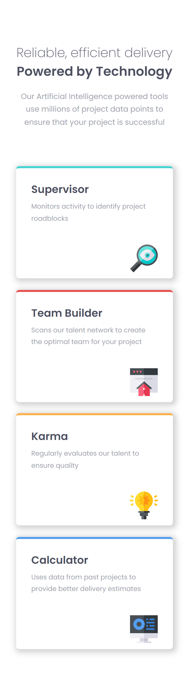
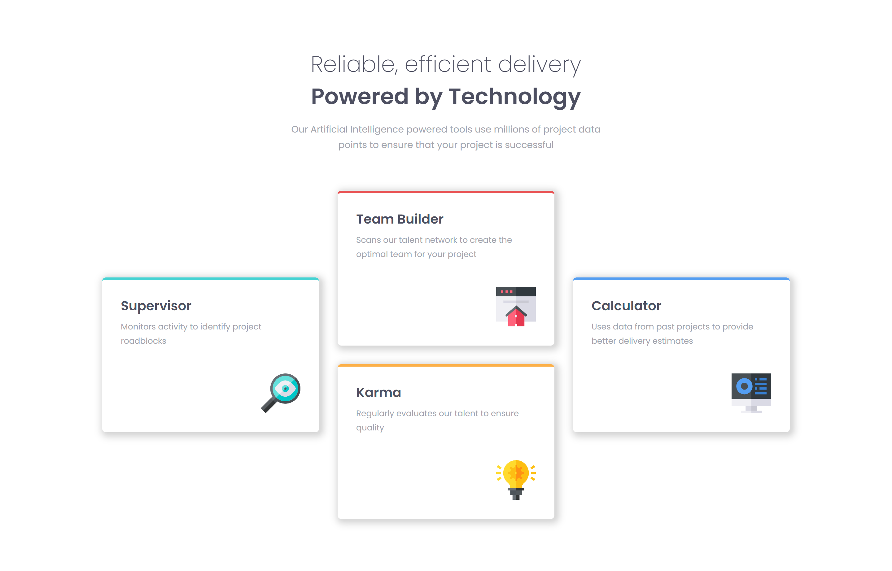

# Frontend Mentor - Four card feature section solution

This is a solution to the [Four card feature section challenge on Frontend Mentor](https://www.frontendmentor.io/challenges/four-card-feature-section-weK1eFYK). Frontend Mentor challenges help you improve your coding skills by building realistic projects.

## Table of contents

- [Overview](#overview)
  - [The challenge](#the-challenge)
  - [Screenshot](#screenshot)
  - [Links](#links)
- [My process](#my-process)
  - [Built with](#built-with)
  - [What I learned](#what-i-learned)
- [Author](#author)

**Note: Delete this note and update the table of contents based on what sections you keep.**

## Overview

### The challenge

Users should be able to:

- View the optimal layout for the site depending on their device's screen size

### Screenshots




### Links

- Solution URL: [Github](https://github.com/Devs-advocate/Four-Card-Feature-Section)
- Live Site URL: [Netlify](https://responsive-card-features.netlify.app/)

## My process

I started with the mobile aspect first. I looked at the mobile image and designed the HTML structure around that. From there I setup the CSS styling with custom properties identified in the style guide, and a basic reset, which is also a .css file in the repository. Styling then began from the top and outer elements and containers, to the elements within, and moving downward.

I'm also deploying on Netlify using a github workflow.

### Built with

- Semantic HTML5 markup
- CSS custom properties
- Flexbox
- CSS Grid
- Mobile-first workflow

### What I learned

I researched a lot about box-shadow, clamp and display CSS properties. I'm also deploying on Netlify using a github workflow.

```css
box-shadow: 3px 1px 5px 3px rgba(0, 0, 0, 0.21), 3px 3px 11px 5px rgba(0, 0, 0, 0.15);

font-size: clamp(1.7rem, 4vw, 2.4rem);
```

## Author

- Frontend Mentor - [@Devs-advocate](https://www.frontendmentor.io/profile/Devs-advocate)
